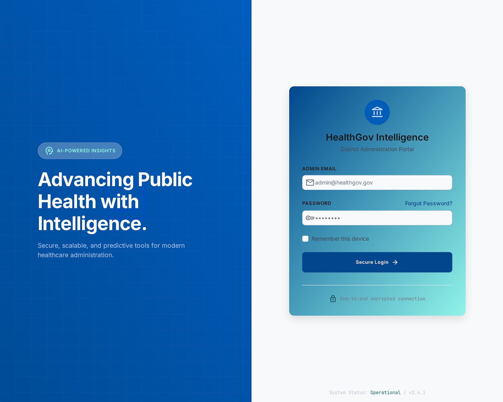

# Vitalis AI - HealthGov Portal

## The Problem
District health administrators often lack real-time visibility into public health metrics, medical inventory, and hospital load. This results in delayed responses to emerging health crises, stockouts of essential medicines, and inefficient emergency routing.

## Why It Matters & Who Benefits
When health departments operate on delayed data, patient care suffers. **Vitalis AI** bridges this gap. It provides government health officials and hospital administrators with a unified, real-time telemetry dashboard. This empowers decision-makers to proactively allocate resources, ensuring citizens receive timely care during both routine operations and emergencies.

## Our Approach
We built a centralized, AI-driven dashboard that aggregates data from Primary Health Centers (PHCs). By integrating Google Gemini's predictive capabilities with real-time tracking, the system processes raw telemetry data and outputs actionable insights—such as forecasting disease trends or warning about impending inventory shortages.

## Unique Value Proposition (USP)
Instead of attempting to build a massive, complex healthcare CRM, Vitalis AI focuses on **actionable administrative telemetry**. Our solution is lightweight, highly practical, and designed specifically for district-level oversight. Even as a small-scale prototype, it demonstrates thoughtful problem-solving, feasibility, and strong potential for real-world government adoption.



Live Link :-https://smart-health-steel.vercel.app

## Key Features
- **Real-Time District Telemetry:** Live monitoring of hospital loads, patient queues, and available beds across multiple PHCs.
- **AI Health Predictions:** Google Gemini-powered forecasting of potential local disease outbreaks based on incoming patient symptoms.
- **Predictive Inventory Management:** AI-driven analysis to forecast required medicine stocks before critical shortages occur.
- **Live Ambulance Tracking:** Mock GPS tracking via WebSockets (Socket.io) to monitor emergency response vehicles in real time.
- **Secure Administrative Access:** A gated portal designed specifically for authorized health officials.

---

## Demo Access
To evaluate the project, please use the following credentials to access the live dashboard:

> **Username:** `admin@health.gov.in`
> **Password:** `admin`

*Note: Authentication is intentionally limited to a single government-official demo account. User registration flows are outside the scope of this prototype, as the platform is intended for internal administrative deployment only.*

---

## Project Limitations (Hackathon Scope)
To ensure we delivered a polished and functional prototype within the time constraints, we intentionally scoped out the following:
- **Complex Role-Based Access Control:** We implemented a single admin role rather than multiple hierarchical government roles (e.g., State vs. District admins).
- **Live Production Database Integrations:** We are utilizing mock datasets to simulate district health metrics instead of connecting to real hospital APIs.
- **Patient-Facing Features:** The scope is strictly limited to the administrator/official viewpoint.

## Running Locally

**Prerequisites:** Node.js (v18+) and MySQL.

1. **Install Dependencies:**
   ```bash
   npm install
   ```
2. **Environment Variables:**
   Create a `.env` file in the root directory:
   ```env
   GEMINI_API_KEY=your_gemini_api_key_here
   PORT=3000
   DB_HOST=localhost
   DB_USER=root
   DB_PASSWORD=your_password
   DB_NAME=vitalis_db
   ```
3. **Database Setup (Initializes schema & seed data):**
   ```bash
   node init_db.js
   ```
4. **Start the Application (Runs Server & Client concurrently):**
   ```bash
   npm run dev
   ```

## Future Scope
While this is a prototype, the architecture is designed to scale. Future iterations could include:
- **IoT Device Integration:** Direct data pipelines from hospital admission systems and ambulances.
- **Multi-District Scaling:** Expanding the dashboard from a single district to state-wide or national oversight using cloud infrastructure.
- **Automated Resource Dispatch:** Allowing the AI to not just predict, but automatically trigger supply routing to critical zones.
